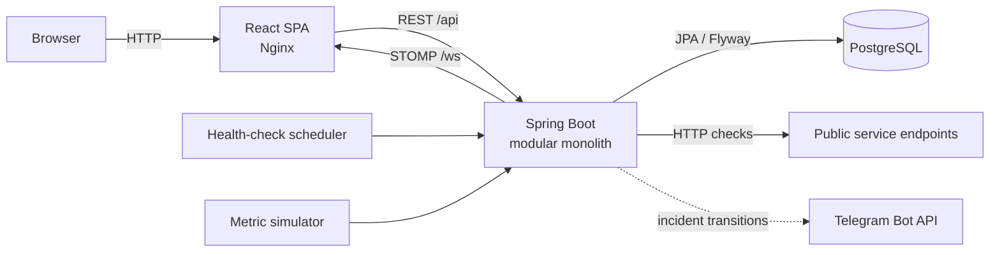

# Pulse

Pulse is a self-hosted service monitoring dashboard. It combines real HTTP availability checks with simulated CPU and memory telemetry so that service health, performance history, threshold alerts, and outages can be explored in one place.

Pulse periodically checks every registered public HTTP/HTTPS endpoint, records its response status and latency, and maintains an `UNKNOWN`/`UP`/`DOWN` service state. A transition to `DOWN` opens one incident; repeated failures remain part of that incident; and the next successful check resolves it. Incident transitions appear in the dashboard immediately and can optionally be sent through Telegram. Independently, the telemetry simulator produces CPU and memory samples and opens or resolves threshold-alert episodes.

The project is intentionally a modular monolith: one React application, one Spring Boot application, and one PostgreSQL database. It does not require agents, a message broker, Redis, or a separate notification service.

## What Pulse provides

- Registration and removal of monitored services, with configurable CPU and memory warning thresholds.
- Scheduled HTTP health checks with status code, response time, failure reason, and history.
- Availability incident tracking with duplicate suppression and automatic recovery.
- Simulated CPU and memory history with independent threshold-alert lifecycles.
- A live dashboard driven by STOMP/WebSocket events, with REST used for initial loading and reconnect recovery.
- Optional Telegram notifications for incident creation and resolution.
- JWT authentication for REST endpoints and STOMP connections.
- SSRF-resistant endpoint validation that blocks private, loopback, link-local, metadata, and other unsafe destinations.
- Local and production-oriented Docker Compose configurations.

## Architecture



In the local Compose stack, the frontend, backend, and PostgreSQL run as three containers on one network. Nginx serves the compiled single-page application and proxies `/api` and `/ws` to Spring Boot, so browser traffic remains same-origin. The production Compose file excludes the frontend and places a dedicated reverse proxy in front of the private backend and database networks.

### Component responsibilities

| Component | Responsibilities |
|---|---|
| React frontend | Authenticates the user; loads durable state with Axios; displays service, metric, alert, health-check, and incident data; maintains one reconnecting STOMP client; and reconciles missed events through REST. |
| Spring Boot backend | Exposes REST and STOMP endpoints; validates authentication and monitor destinations; schedules HTTP checks and simulated metrics; manages alert and incident state transitions; dispatches notifications; and defines transaction boundaries. |
| PostgreSQL | Stores services, metric samples, alert episodes, health-check results, and incidents. Flyway owns the schema and Hibernate validates it at startup. |
| Nginx | Serves the frontend in the local stack and reverse-proxies API and WebSocket traffic. The production configuration exposes only the proxy while keeping the backend and database private. |
| Telegram channel | Optionally sends incident-created and incident-resolved messages. Delivery failures are logged and do not roll back monitoring data or interrupt in-app events. |

The backend follows conventional `controller`, `service`, `repository`, `entity`, and `dto` layers. Cross-cutting `config`, `websocket`, and `notification` packages contain security, commit-safe event delivery, and pluggable notification channels. These packages are modules inside one deployable application, not separate microservices.

### Core data flows

1. **Availability monitoring:** a scheduler selects each registered service, validates and calls its public endpoint, then persists a health check. The result updates service status and opens or resolves a single incident when the status changes.
2. **Telemetry and alerts:** a separate scheduler generates bounded CPU and memory samples. Persisted samples are evaluated against per-service thresholds; one active alert per metric is maintained until recovery.
3. **Real-time delivery:** transactional application events are handled only after commit. Metrics, alerts, health checks, and incident transitions are published to service-specific and dashboard-wide STOMP topics.
4. **Notification delivery:** incident transitions are converted into provider-neutral notifications after commit. The in-app channel publishes STOMP events, while the optional Telegram channel calls the Bot API.
5. **Frontend consistency:** REST is the source of truth for page loads and reconnect recovery. WebSocket messages provide live deltas, and entity IDs make repeated deliveries idempotent.

### Repository layout

```text
Pulse/
|-- backend/                  Spring Boot application, migrations, and tests
|-- frontend/                 React/Vite dashboard and frontend tests
|-- deploy/nginx/             Production reverse-proxy configuration
|-- docs/architecture.md      Detailed original architecture and design decisions
|-- docker-compose.yml        Local full-stack environment
`-- docker-compose.production.yml
                              Production-oriented backend stack
```

## Technology baseline

- Java 25 LTS, Spring Boot 4.1.1, Maven, Spring Security, JPA, Flyway, and STOMP/WebSocket
- Node.js 24 LTS, React 19, TypeScript 5.9, Vite 7, Tailwind CSS 4, Axios, and Recharts
- PostgreSQL 18
- Nginx, Docker, and Docker Compose
- JUnit 5, Spring Boot Test, MockMvc, and Vitest

## Run with Docker Compose

Docker Desktop (or Docker Engine with Compose v2) is required.

```bash
cp .env.example .env
docker compose up --build
```

On Windows PowerShell, use `Copy-Item .env.example .env` instead of `cp`. Compose requires the database name, user, and password plus the authentication values described below. The example database password is for local development only; replace it with a strong secret for any non-local environment.

Open <http://localhost:3000>. Backend health is available at <http://localhost:8080/actuator/health>. Stop the application with:

```bash
docker compose down
```

Add `--volumes` only when you intentionally want to delete the local PostgreSQL data volume.

PostgreSQL and Spring Boot are published only on the host loopback interface for local tools and diagnostics. Containers still reach PostgreSQL at `postgres:5432`. Configure browser-to-backend addresses and the allowed browser origin with:

| Variable | Local default | Purpose |
|---|---|---|
| `VITE_API_BASE_URL` | `/api` | Public API base URL embedded in the frontend build. Set an absolute HTTPS URL for a separately hosted frontend. |
| `VITE_WS_URL` | Same-origin `/ws` | Public STOMP WebSocket URL embedded in the frontend build. Set an absolute WSS URL for a separately hosted frontend. |
| `CORS_ALLOWED_ORIGIN` | `http://localhost:3000` in Compose | Exact browser origin accepted by the backend REST and WebSocket endpoints. Wildcard origins are not used. |

`VITE_*` values are public browser configuration and are visible in the built frontend. Never put passwords, tokens, or other secrets in them. Leaving the two Vite variables empty preserves local Nginx/Vite proxy behavior.

## Production Docker Compose

`docker-compose.production.yml` prepares the server-side stack for a future Oracle VM while
leaving the local `docker-compose.yml` workflow unchanged. It contains PostgreSQL, Spring Boot,
and a dedicated Nginx reverse proxy; the React frontend is intentionally excluded because it
will be hosted separately.

```bash
docker compose -f docker-compose.production.yml config --quiet
docker compose -f docker-compose.production.yml up --build -d --wait
```

Only the reverse proxy publishes a host port (`PROXY_HTTP_PORT`, default `80`). PostgreSQL remains
available only as `postgres:5432` on the internal data network, while Spring Boot remains available
only as `backend:8080` to other containers. The proxy forwards `/api`, `/ws`, and exactly
`/actuator/health`; its `/ws` route preserves WebSocket upgrade headers. Port 80 is an HTTP-only
placeholder for local validation and must not be exposed to the internet until TLS is configured.

Production requires `POSTGRES_DB`, `POSTGRES_USER`, `POSTGRES_PASSWORD`, `PULSE_AUTH_USERNAME`,
`PULSE_AUTH_PASSWORD_HASH`, `PULSE_JWT_SECRET`, and an exact `CORS_ALLOWED_ORIGIN`. Telegram
credentials are required only when `PULSE_TELEGRAM_ENABLED=true`. The remaining tuning variables
retain their documented defaults. Supply secrets through the VM's protected environment or an
uncommitted `.env` file; never commit the populated values.

## Authentication and endpoint safety

Pulse uses one environment-configured application user. `POST /api/auth/login` accepts its
username and password and returns a short-lived HMAC-SHA-256 JWT. All other `/api/**` requests
require `Authorization: Bearer <token>`. STOMP clients send the same header in their CONNECT
frame. `/actuator/health` remains public for container health checks; no other actuator endpoint
is exposed.

Configure these server-only values in `.env` before starting Compose:

| Variable | Default | Purpose |
|---|---:|---|
| `PULSE_AUTH_USERNAME` | required | Initial application username. |
| `PULSE_AUTH_PASSWORD_HASH` | required | BCrypt hash of the application password. Store the hash, never the plaintext password. In a Compose `.env` file, single-quote the hash so its `$` characters remain literal. |
| `PULSE_JWT_SECRET` | required | Base64-encoded random key of at least 32 bytes. Generate it with a cryptographically secure local tool, for example `openssl rand -base64 32`. |
| `PULSE_JWT_EXPIRATION_MS` | `900000` | Access-token lifetime in milliseconds (15 minutes by default). |

Do not put any of these values in `VITE_*` variables or commit a populated `.env`. The frontend
keeps the access token in `sessionStorage`, adds it to REST requests and STOMP CONNECT, and returns
to the login page when it expires or the backend rejects it.

Registered monitor endpoints are restricted to absolute HTTP/HTTPS URLs whose resolved addresses
are public. Loopback, private, link-local, multicast, cloud-metadata, and obvious internal/Docker
destinations are rejected before persistence and again before each request. The HTTP client pins
validation to the DNS addresses it actually uses and does not follow redirects; a redirect target
is validated and recorded as a non-UP response without being requested.

## Telegram incident notifications

Pulse can send incident-created and incident-resolved notifications through the official
Telegram Bot API `sendMessage` method. The channel is disabled by default, and Pulse starts
normally without any Telegram credentials.

To enable delivery, create a `.env` file from `.env.example` and configure:

| Variable | Default | Purpose |
|---|---|---|
| `PULSE_TELEGRAM_ENABLED` | `false` | Enables the Telegram notification channel. |
| `PULSE_TELEGRAM_BOT_TOKEN` | empty | Bot token issued by BotFather. |
| `PULSE_TELEGRAM_CHAT_ID` | empty | Target user, group, or channel chat ID. |
| `PULSE_TELEGRAM_API_BASE_URL` | `https://api.telegram.org` | Telegram Bot API base URL. Override primarily for testing. |
| `PULSE_TELEGRAM_TIMEOUT_MS` | `5000` | Connect and response timeout in milliseconds. |

Create a bot by messaging [BotFather](https://t.me/BotFather) in Telegram and copy the bot
token into `PULSE_TELEGRAM_BOT_TOKEN`. Start a direct chat with the bot, or add it to the
target group/channel and send a message there, so the bot can send messages to that chat.
Obtain the target chat ID (for example, from the Bot API `getUpdates` response), set
`PULSE_TELEGRAM_CHAT_ID`, and then set `PULSE_TELEGRAM_ENABLED=true`. Never commit a real bot
token or chat ID.

Telegram is a second implementation of the existing `NotificationChannel` interface. Incident
transitions remain provider-independent, delivery runs only after the incident transaction
commits, and a Telegram API failure is logged without interrupting in-app STOMP delivery.

## Run applications locally

Start only PostgreSQL with `docker compose up postgres`, then run:

Before launching Spring Boot directly, export `PULSE_AUTH_USERNAME`,
`PULSE_AUTH_PASSWORD_HASH`, and `PULSE_JWT_SECRET` in that terminal. These are mandatory server
settings; Compose reads them from `.env`, but a direct Maven process does not.

```bash
cd backend
mvn test
mvn spring-boot:run
```

In another terminal:

```bash
cd frontend
npm ci
npm run dev
```

Local backend development requires Java 25 and Maven 3.6.3 or newer; Node.js 24 is recommended for the frontend. Vite serves at <http://localhost:5173> and proxies API/WebSocket traffic to port 8080.

## API

| Method | Endpoint | Purpose |
|---|---|---|
| `POST` | `/api/auth/login` | Exchange the configured username/password for an access token |
| `POST` | `/api/services` | Register a service |
| `GET` | `/api/services` | List services |
| `GET` | `/api/services/{id}` | Get a service |
| `DELETE` | `/api/services/{id}` | Delete a service |
| `PATCH` | `/api/services/{id}/thresholds` | Update CPU and memory warning thresholds |
| `GET` | `/api/services/{id}/metrics?limit=100` | Get recent metrics in chronological order (maximum 500) |
| `GET` | `/api/services/{id}/alerts?status=ACTIVE&limit=100` | Get bounded alert history, optionally filtered by status |
| `GET` | `/api/alerts/active?limit=500` | Get active alerts across services |
| `GET` | `/api/services/{id}/health-checks?limit=100` | Get recent endpoint health-check results |
| `GET` | `/api/services/{id}/incidents?status=ACTIVE&limit=100` | Get bounded incident history, optionally filtered by status |
| `GET` | `/api/incidents/active?limit=500` | Get active incidents across services |

The backend generates one simulated sample per registered service every five seconds by default and evaluates it against that service's thresholds. CPU and memory episodes are independent. Thresholds default to 80%, must be greater than zero and at most 100%, and can be set during registration or edited in service details.

The health scheduler checks registered endpoints every 30 seconds by default. It records every result and updates service availability, while an availability transition creates or resolves an incident. The STOMP endpoint `/ws` publishes committed data on the following topics:

- `/topic/services/{serviceId}/metrics`
- `/topic/services/{serviceId}/alerts` and `/topic/alerts`
- `/topic/services/{serviceId}/health-checks` and `/topic/health-checks`
- `/topic/services/{serviceId}/incidents` and `/topic/incidents`

Metric simulation and retrieval can be tuned without rebuilding:

| Variable | Default | Purpose |
|---|---:|---|
| `PULSE_METRICS_ENABLED` | `true` | Enable scheduled sample generation |
| `PULSE_METRICS_INTERVAL_MS` | `5000` | Delay between completed generation runs |
| `PULSE_METRICS_DEFAULT_LIMIT` | `100` | History rows returned when `limit` is omitted |
| `PULSE_METRICS_MAX_LIMIT` | `500` | Server-side upper bound for history requests |
| `PULSE_ALERTS_DEFAULT_LIMIT` | `100` | Default alert-history result size |
| `PULSE_ALERTS_MAX_LIMIT` | `500` | Server-side upper bound for alert requests |
| `PULSE_HEALTH_ENABLED` | `true` | Enable scheduled endpoint health checks |
| `PULSE_HEALTH_INTERVAL_MS` | `30000` | Delay between completed health-check runs |
| `PULSE_HEALTH_TIMEOUT_MS` | `3000` | HTTP connection and response timeout |
| `PULSE_HEALTH_DEFAULT_LIMIT` | `100` | Default health-check history size |
| `PULSE_HEALTH_MAX_LIMIT` | `500` | Server-side upper bound for health-check requests |
| `PULSE_INCIDENTS_DEFAULT_LIMIT` | `100` | Default incident-history result size |
| `PULSE_INCIDENTS_MAX_LIMIT` | `500` | Server-side upper bound for incident requests |

Metric values are simulations and are not collected from the registered endpoint; availability data does come from real HTTP checks. Automatic retention and aggregation are future concerns, so long-running installations should manage database growth operationally for now.

## Verification

```bash
cd backend
mvn test
mvn package

cd ../frontend
npm ci
npm test
npm run build

cd ..
docker compose config
docker compose up --build --wait
```

The integration tests use `DB_URL`, `DB_USERNAME`, and `DB_PASSWORD` and exercise a real PostgreSQL database. The backend suite also covers authentication and authorization, SSRF defenses, WebSocket authorization and payload publication, after-commit configuration, and persistence-failure suppression. Frontend tests cover session handling plus duplicate metric and alert event handling. The backend container build can be used when Maven or Java 25 is not installed on the host.

## Future improvements

Potential later improvements include a real telemetry pipeline, retention and aggregation policies, advanced user management, additional notification providers, distributed processing, observability, CI/CD, and cloud deployment. They are deliberately absent from the current modular-monolith design.
