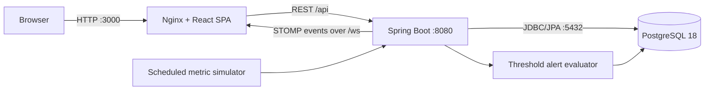
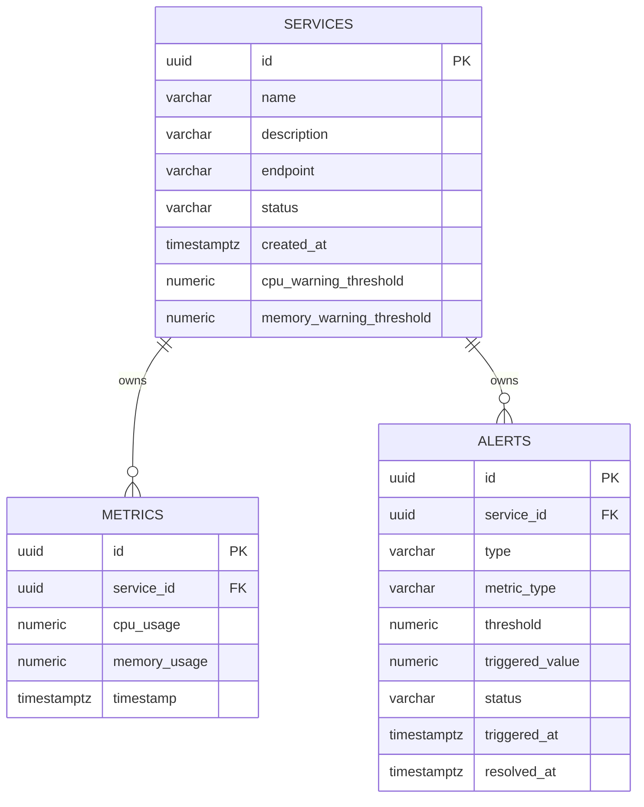

# Pulse Phase 1 Architecture

## Scope and system overview

Pulse Phase 1 is a single-deployment, three-container monitoring MVP. A React single-page application calls one Spring Boot application, which owns the use cases and stores durable state in PostgreSQL. Metrics are simulated inside the backend; no external agent or message broker is involved.

The repository implements Service Management, Simulated Metric Persistence, Alert Persistence with Threshold Evaluation, and commit-safe real-time delivery. The UI loads durable state through REST, then applies metric and alert deltas over STOMP. Spring Boot generates samples, persists them, evaluates independent CPU/memory alert episodes, and publishes only committed changes.

## Responsibilities

### Frontend

- Present summary counts, a service list, registration form, service details, current CPU/memory values, charts, and a recent-values table.
- Load services, metrics, alert history, and the active-alert summary through relative REST URLs using Axios.
- Load metric and alert history when a service is selected and retain manual refresh as recovery.
- Display validation, network, and server errors without hiding failures.
- Use Recharts for charts and Tailwind CSS for styling.
- Configure CPU and memory thresholds during registration or from service details.
- Maintain one reconnecting STOMP connection and fan out live metric and alert deltas to dashboard subscribers.
- Refresh relevant REST state after a reconnect to recover events missed while disconnected.
- In development, Vite proxies `/api` and `/ws` to `localhost:8080`; in containers, Nginx proxies those paths to `backend`.

### Backend

- Validate service input and expose focused REST controllers using request/response DTOs.
- Coordinate transactions in service classes and persist services, metrics, and alerts through Spring Data JPA.
- Generate bounded, smoothly varying CPU and memory samples for every registered service on a configurable schedule.
- Keep independent simulator state per service and isolate a failed service so the remaining services still receive samples.
- Return a consistent error body for validation, not-found, and server errors.
- Evaluate persisted metrics, suppress duplicate active episodes, and resolve recovered conditions.
- Serialize evaluation per service with a row lock and enforce one active episode per metric type with a partial unique index.
- Register metric and alert application events inside their owning transactions and deliver them through STOMP only after commit.

The conventional packages are `controller`, `service`, `repository`, `entity`, `dto`, `websocket`, and `config`. These are layers inside one application, not separate services.

### Database

PostgreSQL is the system of record. UUIDs are primary keys, `TIMESTAMPTZ`/Java `Instant` represent UTC time, and Flyway is the only schema owner. Hibernate validates the schema. A normalized case-insensitive unique index protects service names.

Migration `V2` adds metrics with 0–100 checks and indexed history. Migration `V3` adds threshold columns and alert episodes with enum-style checks, lifecycle consistency checks, cascade deletion, history/active indexes, and a partial unique index on `(service_id, metric_type)` while status is `ACTIVE`.

## REST API overview

All endpoints use JSON and are rooted at `/api`.

| Method | Path | Purpose | Success |
|---|---|---|---|
| `POST` | `/api/services` | Validate and register a service | `201 Created` |
| `GET` | `/api/services` | List registered services | `200 OK` |
| `GET` | `/api/services/{id}` | Get one service | `200 OK` |
| `DELETE` | `/api/services/{id}` | Delete a service and its metrics | `204 No Content` |
| `PATCH` | `/api/services/{id}/thresholds` | Update CPU/memory thresholds | `200 OK` |
| `GET` | `/api/services/{id}/metrics?limit={n}` | Return the newest bounded window, oldest-to-newest | `200 OK` |
| `GET` | `/api/services/{id}/alerts?status={status}&limit={n}` | Return newest alert episodes, optionally filtered | `200 OK` |
| `GET` | `/api/alerts/active?limit={n}` | Return active episodes across services | `200 OK` |

The metric limit defaults to 100, rejects values below one, and is capped at 500. Unknown services return 404. Errors use `{timestamp, status, code, message, fieldErrors}` and do not leak internals.

## WebSocket communication

The `/ws` endpoint uses STOMP with Spring's in-process simple broker. Browser traffic reaches it directly in Vite development and through Nginx in Compose.

- `/topic/services/{serviceId}/metrics` publishes a `MetricResponse` after a metric transaction commits.
- `/topic/services/{serviceId}/alerts` publishes `{eventType, alert}` for `CREATED` and `RESOLVED` transitions after the alert transaction commits.
- `/topic/alerts` publishes the same alert transition for dashboard-wide active-alert counts.
- Spring application events separate transactional work from STOMP delivery; `@TransactionalEventListener(AFTER_COMMIT)` prevents rolled-back writes from producing messages.
- The React provider owns one STOMP connection, reconnects after three seconds, restores subscriptions, and invokes REST recovery callbacks after reconnection.
- Metric and alert IDs are used as idempotency keys when applying live events, so duplicate deliveries replace existing entries.
- REST remains the durable source for initial loads, manual refresh, and reconnect recovery; WebSocket messages are live deltas.

No Kafka, Redis, or external STOMP broker is needed.

## Metric generation flow

1. A single `@Scheduled` job runs with a configurable fixed delay, defaulting to five seconds.
2. It loads all registered services.
3. For each service, a stateful simulator applies small deterministic sine/cosine deltas to that service's previous values, clamps values to 0–100, rounds to two decimals, and persists a sample in its own transaction.
4. After the metric transaction commits, its DTO is published to the service metric topic.
5. Alert evaluation creates, maintains, or resolves CPU and memory episodes in a separate transaction.
6. A failure for one service is logged and does not stop the remaining services.
7. REST endpoints provide bounded metric and alert history for initial and recovery loads.

The values are realistic-looking test data; the registered endpoint is not contacted. Automatic retention and aggregation are outside this slice and should be designed before long-running production use.

## Alert generation flow

After a metric commits, `AlertEvaluationService` locks the affected service row and evaluates CPU and memory independently. A value strictly above its threshold creates an `ACTIVE` episode only when no active episode exists. Continued violations leave that episode unchanged. A value at or below the threshold changes the active episode to `RESOLVED` and records `resolved_at`; a later breach creates a new episode rather than reopening history. Evaluation uses the metric timestamp and preserves the original threshold and triggering value. Created and resolved DTO payloads are published only after the evaluation transaction commits.

## Configuration strategy

| Variable | Purpose | Default |
|---|---|---|
| `DB_URL` | JDBC connection URL | `jdbc:postgresql://localhost:5432/pulse` |
| `DB_USERNAME` | Database user | `pulse` |
| `DB_PASSWORD` | Database password | `pulse` |
| `CORS_ALLOWED_ORIGIN` | Exact browser origin allowed by REST and WebSocket | `http://localhost:5173` |
| `PULSE_METRICS_ENABLED` | Enable scheduled simulation | `true` |
| `PULSE_METRICS_INTERVAL_MS` | Delay between generation runs | `5000` |
| `PULSE_METRICS_DEFAULT_LIMIT` | Default REST history size | `100` |
| `PULSE_METRICS_MAX_LIMIT` | Maximum REST history size | `500` |
| `PULSE_ALERTS_DEFAULT_LIMIT` | Default alert-history size | `100` |
| `PULSE_ALERTS_MAX_LIMIT` | Maximum alert-history size | `500` |
| `JPA_DDL_AUTO` | Hibernate schema verification | `validate` |

Compose provides non-secret developer defaults and supports a gitignored `.env`; `.env.example` documents the values. Production deployments must inject secrets and an explicit HTTPS origin. Browser code uses relative `/api` and `/ws` paths, so no container hostname is embedded in the bundle.

## Development, production, and Docker architecture

- Local development: PostgreSQL can run via Compose while Spring Boot and Vite run on the host. Vite proxies API/WebSocket paths and Spring allows `http://localhost:5173` by default.
- Containerized MVP: `postgres`, `backend`, and `frontend` share the Compose network and resolve one another by service name. Nginx provides same-origin browser access at `http://localhost:3000`.
- Production-shaped images: the frontend is built once and served by Nginx; the backend runs as a non-root user in a JRE-only image; PostgreSQL uses a named volume.
- TLS termination, managed secrets, backups, cloud deployment, and scaling remain operational future work.

## Build and version decisions

- Java 25 LTS, Spring Boot 4.1.1, Maven 3.9.11, executable JAR.
- Node.js 24 LTS, React 19.3, TypeScript 5.9, Vite 7.3, Tailwind CSS 4.3, Axios, Recharts, and `@stomp/stompjs`.
- PostgreSQL 18 (verified against 18.6), Flyway migrations, and Hibernate schema validation.
- JUnit 5, Mockito, Spring Boot Test, and MockMvc; integration tests use real PostgreSQL rather than H2.

## Testing

The current 37-test backend suite covers service and metric behavior, alert lifecycles, REST persistence workflows against real PostgreSQL, event creation, STOMP destinations, failure suppression, and after-commit listener configuration. Vitest covers ID-based duplicate metric/alert handling; TypeScript and the production build remain release gates.

## Explicit exclusions

Phase 1 does not include Kafka, Redis, Keycloak, OAuth2, Kubernetes, cloud deployment, Prometheus, Grafana, real monitoring agents, microservices, CI/CD, multi-tenancy, advanced alert rules, or a mobile application. The architecture contains no placeholder infrastructure for these features.
